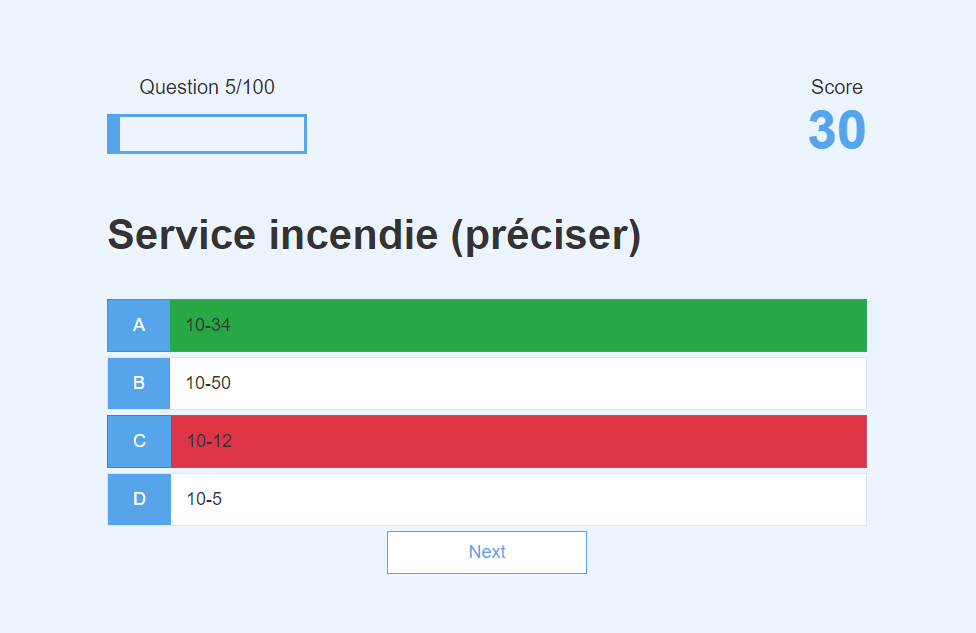

# 10Codes Quiz App with HTML, CSS, and JavaScript

# To use it 

[Link to the Quiz App](https://habilya.github.io/10code-quiz/)

# For developpers
To setup a webserver containder run  `docker compose -f docker-compose.yml up`
Run the Api Project
Go here in you browser [http://localhost:8080/10code-quiz/](http://localhost:8080/10code-quiz/)

# Credits
Forked from this repository: [Originally forked from](https://github.com/jamesqquick/Design-And-Build-A-Quiz-App)
